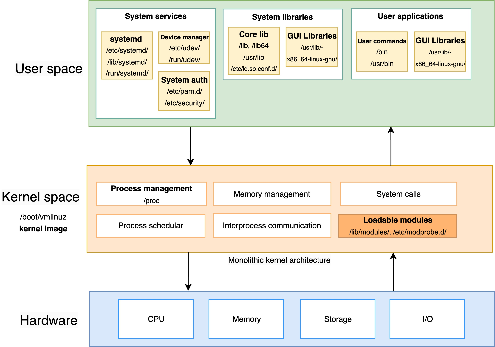

# Understand OS Architecture

## Diagram

## Explanations

### Kernel
1.  **The core kernel components :** These are statically linked into the kernel
    1. **Process scheduler :** Schedule processes to be executed by the CPU.
    1. **Memory management :** Handle memory allocations, free up and paging.
    2. **System calls :** Middleware or gateway for userspace requests.

2. **Loadable Kernel Modules :** These are object files which are ready to be link to the kernel at runtime (instead of rebooting all system), which allow saving memory by unloading them after we don't need them, 
> For example, when we plug USB, linux might load a module named `usb_storage.ko`, when we unplug the USBm this module will be unlinked (`modprob` program will handles this load/unload in linux)

### User space

1. **System Services :**
    1. **systemd :** Initialize system.
    2. **Device manager (udev) :** Recognize hardware devices and manage them in Linux, when a new device plugged :
        * udev creates device node in /dev.
        * udev rules Define how devices are handled (stored in `/etc/udev/rules.d/`).   
    2. **System authentication (PAM):** It's like an authentication framework, located in `/etc/pam.d/`, it ensures : 
        * Account management.
        * Authentication.
        * Password management.
        * Session management.

### Key interactions

1. **System calls :** Primary boundary between userspace and kernel.
2. **Interprocess communication: :** 
    1. D-Bus for high-level service communication.
    2. Kernel IPC for low-level process communication.
    3. Shared memory and message passing.
3. **Device Management :**
    1. Kernel modules handle hardware directly.
    2. udev manages device events and configuration.
    3. D-Bus notifies applications of device changes.
4. **Security and Access Control:**
    1. SELinux/LSM in kernel space.
    2. PAM in user space.
    3. Permission checking at multiple levels.