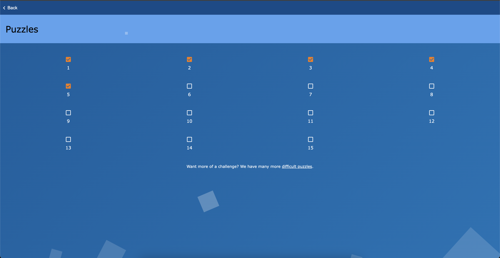

# Hands on regular expressions

1. **Display a list of all the users on your system who log in with the Bash shell as a default.**
```bash
awk -F: '/\/bin\/bash/ {print $1}' /etc/passwd
```
> $1 to select first column which represente username

2. **From the `/etc/group` directory, display all lines starting with the string "daemon".**
```bash
awk -F: '/^daemon/ {print $0}' /etc/group
```

3. **Print all the lines from the same file that don't contain the string.**

```bash
awk -F: '!/.*daemon.*/ {print $0}' /etc/group
```

4. **Display localhost information from the `/etc/hosts` file, display the line number(s) matching the search string and count the number of occurrences of the string.**
```bash
# show localhost information (ipv4 and ipv6 addresses)
awk -F" " '!/^#/ {print $0}' /etc/hosts | awk -F" " '/localhost/{print $1} '
    
# display line number matching "localhost" with the number of occurrences
awk -F" " '/localhost/ {print "Line", NR ":", $0 count++} END {print "Count:", count}' /etc/hosts
```

5. **Display a list of `/usr/share/doc` subdirectories containing information about shells.**

```bash
find /usr/share/doc -type d | grep -i "sh\|bash\|zsh"
```

6. **How many `README` files do these subdirectories contain? Don't count anything in the form of "README.a_string".**

```bash
find /usr/share/doc/* -type f -name "*README" | wc -l
```

7. **Make a list of files in your home directory that were changed less that 10 hours ago, using grep, but leave out directories.**

```bash
find ~ -type f -mtime -10h -maxdepth 1
```
> Here i havn't understand how to use grep.

8. **Can you find an alternative for `wc -l`, using grep?**
```bash
ls | grep ""  -c
# equivalent to
ls | wc  -l
```

9. **Using the file system table (`/etc/fstab` for instance), list local disk devices.**
```bash
mount | awk -F" " '/^\/dev/ {print $1}'
```

10. **Display configuration files in `/etc` that contain numbers in their names.**

```bash
find /etc/ -maxdepth 1 -type f | awk -F"/" '/[0-9]/ {print $4}'
```

### Screenshots on my evaluation

