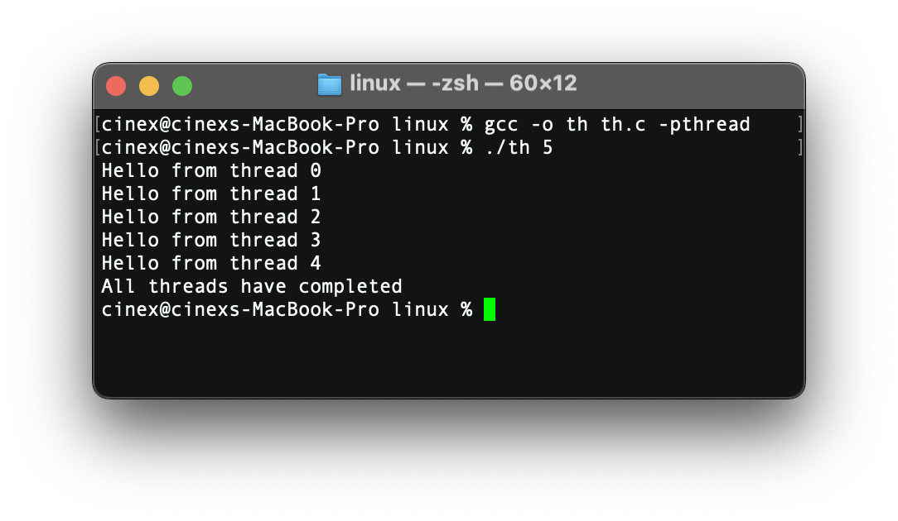

# Hands on Awk & Sed / POSIX

1. **Give the AWK script that displays the word frequency of a text.**

```bash
# word_counter.awk
# Usage: awk -f word_counter.awk input.txt

{
    for (i = 1; i <= NF; i++) {
        word = tolower($i)
        freq[word]++
    }
}

END {
    # Print each word and its count
    for (word in freq) {
        print word, freq[word]
    }
}
```

2. **Create an AWK script that show the number of repetition of a specific string in a list of strings then inverse it.**
```bash
# script.awk
# Usage: awk -v search="target_word" -f script.awk input.txt

BEGIN {
    if (search == "") {
        print "Please provide a search string using -v search=\"your_string\""
        exit 1
    }
    s = tolower(search)
    count = 0
}
{
    for (i = 1; i <= NF; i++) {
        word = tolower($i)
        if (word == s){
            count++
        }
    }
}

END {
    print "The string \"" search "\" appears " count " times"
}
```

3. **Given a list of telephone numbers of the form `123456789` use sed to rewrite them as `(123)456-789`.**

```bash
 echo "123456789" | sed 's/\([0-9]\{3\}\)\([0-9]\{3\}\)\([0-9]\{3\}\)/(\1)\2-\3/'
 # return (123)456-789
```

4. **Use sed to select and convert all file names with suffix .html given as output by ls into capital letters with suffix .HTM. Check out command y in sed man page.**

```bash
ls *.html | sed 'y/abcdefghijklmnopqrstuvwxyz/ABCDEFGHIJKLMNOPQRSTUVWXYZ/; s/\.HTML$/\.HTM/'
```

5. **Use sed to extract full user names from `/etc/passwd`.**

```bash
sed -E '/^#|^$/d; s/^([^:]+):.*/\1/' /etc/passwd
# /^#|^$/d; => to exclude comments and empty lines
```

6. **Threads**

```c
#include <pthread.h>
#include <stdio.h>
#include <stdlib.h>
#include <unistd.h> 

void* thread_logic(void* arg) {
    printf("Hello from thread\n");
    sleep(1);
    return NULL;
}

int main(int argc, char* argv[]) {
    int num_threads = atoi(argv[1]);
    if (num_threads <= 0) {
        printf("Please specify a positive number of threads\n");
        return 1;
    }

    pthread_t* threads = malloc(num_threads * sizeof(pthread_t));

    for (int i = 0; i < num_threads; i++) {
        int result = pthread_create(&threads[i], NULL, thread_logic, NULL);
        
        if (result != 0) {
            printf("Thread creation failed for thread %d\n", i);
            return 1;
        }
    }

    for (int i = 0; i < num_threads; i++) {
        pthread_join(threads[i], NULL);
    }

    // Clean up
    free(threads);

    printf("All threads have completed\n");
    return 0;
}
```

**Passing priority value to each thread**

```c
#include <pthread.h>
#include <stdio.h>
#include <stdlib.h>
#include <unistd.h> 

void* thread_logic(void* arg) {
    int p = *(int*)arg; // access to the passed priority using the pointer
    printf("Hello from thread %d\n", p);
    sleep(1);
    return NULL;
}

int main(int argc, char* argv[]) {
    int num_threads = atoi(argv[1]);
    if (num_threads <= 0) {
        printf("Please specify a positive number of threads\n");
        return 1;
    }

    pthread_t* threads = malloc(num_threads * sizeof(pthread_t));
    int* priorities = malloc(num_threads * sizeof(int)); // array to store priorities

    for (int i = 0; i < num_threads; i++) {
        priorities[i] = i;
        int result = pthread_create(&threads[i], NULL, thread_logic, &priorities[i]); // passing the pointer to the value we want to pass instead of NULL
        
        if (result != 0) {
            printf("Thread creation failed for thread %d\n", i);
            return 1;
        }
    }

    for (int i = 0; i < num_threads; i++) {
        pthread_join(threads[i], NULL);
    }

    // Clean up
    free(threads);

    printf("All threads have completed\n");
    return 0;
}
```
**Output**
