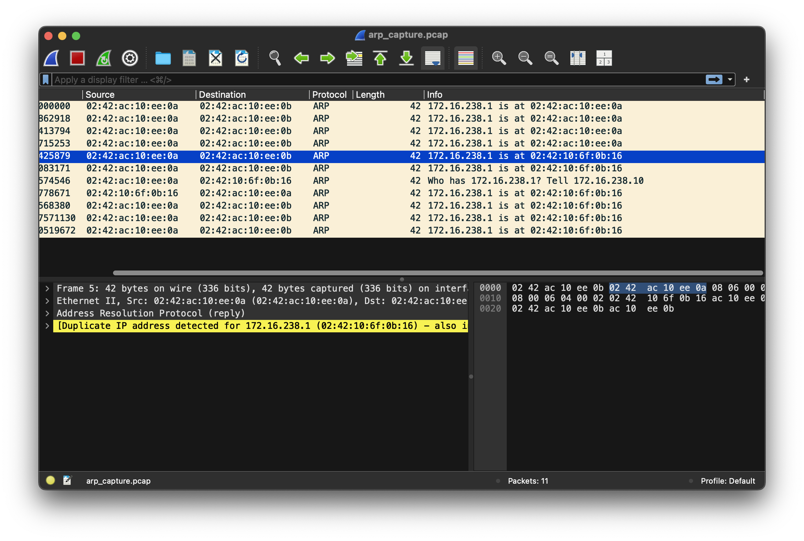

# Getting hands dirty with networking

## Request 
Simulate and ARP poisoning attack using two virtual machine & validate your exploit using wireshark.

## Setup
In order to simulate the attacks, i have created 2 containers (to simulate target and attacker machines).
First, i create ubuntu image with the all necessary tools using this `Dockerfile`.

```Dockerfile
FROM ubuntu:latest

RUN apt-get update && \
    DEBIAN_FRONTEND=noninteractive apt-get install -y \
    tshark \
    dsniff \
    net-tools \
    iputils-ping \
    iproute2 \
    && rm -rf /var/lib/apt/lists/*

# This allows capture without sudo
RUN setcap cap_net_raw,cap_net_admin=eip /usr/bin/dumpcap

# Keep container running
CMD ["tail", "-f", "/dev/null"]
```

This command `setcap cap_net_raw,cap_net_admin=eip /usr/bin/dumpcap` will give the necessary capabilites to wireshark (`/usr/bin/dumpcap` is the program that capture the flow) :
* `cap_net_raw` means permission to capture raw packets.
* `cap_net_admin` means permission to configure network interfaces (like configure specific capture filters at the interface level).
* `eip` :
  * `e` (Effective) : The capability is activated when the program runs.
  * `i` (Inheritable) : Child processes can inherit these capabilities.
  * `p` (Permitted) : The program is allowed to use these capabilities.

Then, i have used the same image to run the 2 containers (victim and attacker machines), using this `docker-compose.yaml` file.

```yaml
version: '3'

services:
  attacker:
    build: .
    container_name: attacker
    privileged: true
    cap_add:
      - NET_ADMIN
      - NET_RAW
    networks:
      lab_network:
        ipv4_address: 172.16.238.10
    tty: true
    stdin_open: true

  target:
    build: .
    container_name: target
    networks:
      lab_network:
        ipv4_address: 172.16.238.11
    tty: true
    stdin_open: true

networks:
  lab_network:
    driver: bridge
    ipam:
      config:
        - subnet: 172.16.238.0/24
```

I have fixed the IP addresses for both containers to facilitate the simulation:
* `172.16.238.10` for attacker.
* `172.16.238.11` for victim or target.

Both containers are in the same network `lab_network`, with `bridge` to enable communication between them

## Attack simulation

The attacks aims to inject a wrong entry in the ARP cache of the victim, basically, the attacker will send ARP replies that map gateway ip address `172.16.238.1` with a wrong MAC address which is `02:42:10:6f:0b:16` then change it to `02:42:ac:10:ee:0a` as shown in the next screenshot.

> **Attacker** shell is on the **right** side, and victim is on the left side. 


## Wireshark

During the attack, i run the following command to capture the flow of ARP packets and store them locally:
```bash
tshark -i eth0 -f "arp" -w /tmp/arp_capture.pcap
```

After terminating the attack and saving the flow in the `/tmp/arp_capture.pcap` file, i have copied this file in order to open it with wireshark and see the content of the flow of packets during the attack :



Here you can clearly see how the attack was performed using a flow of ARP replies packets that contains a misleading IP/MAC addresses mapping.