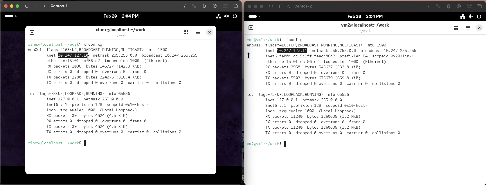
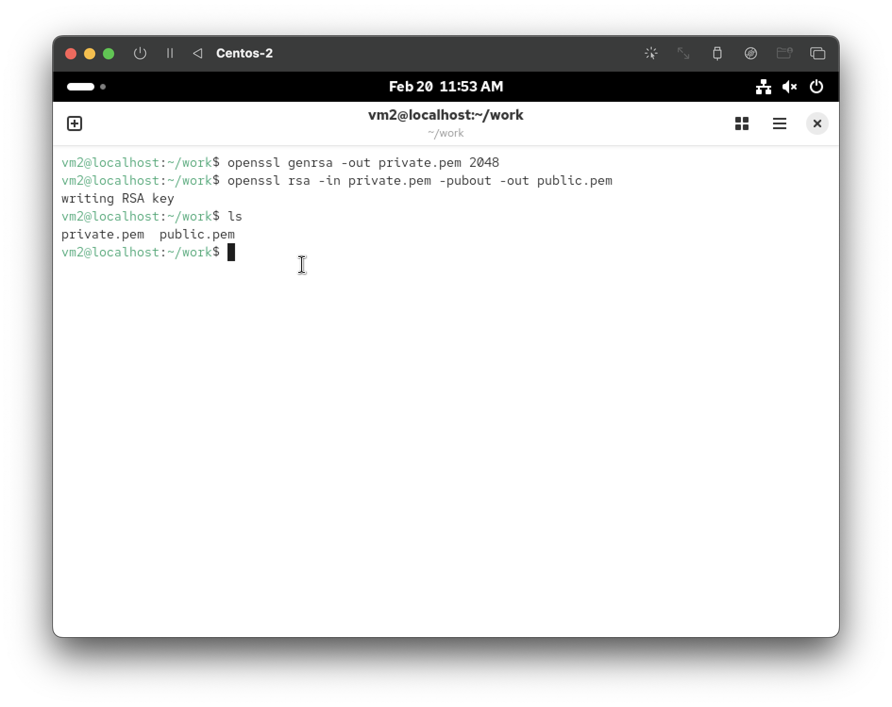
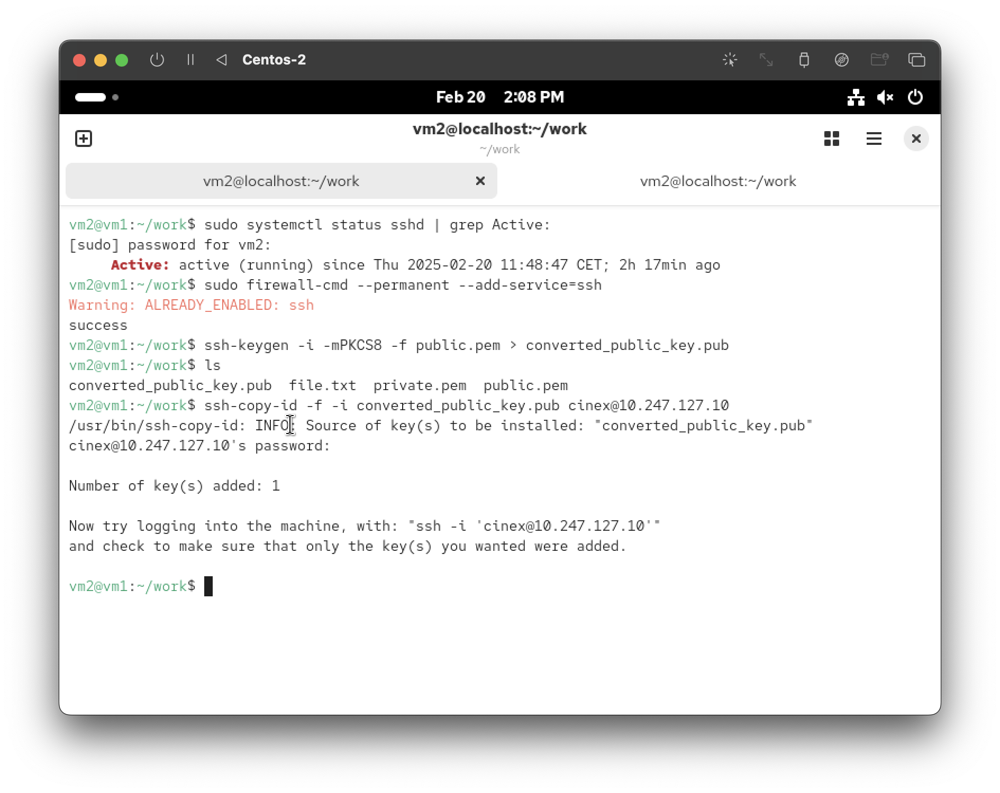
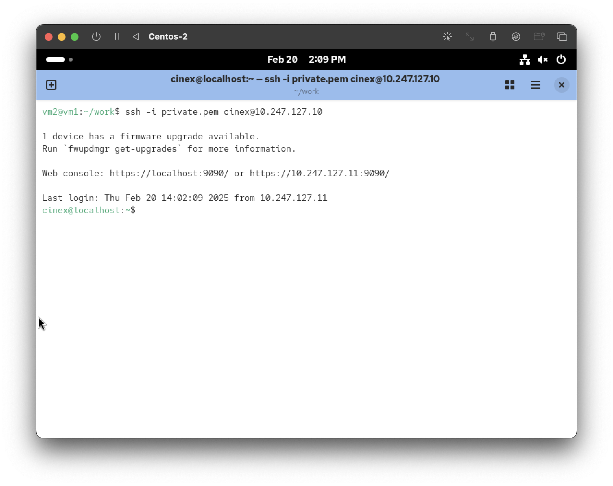
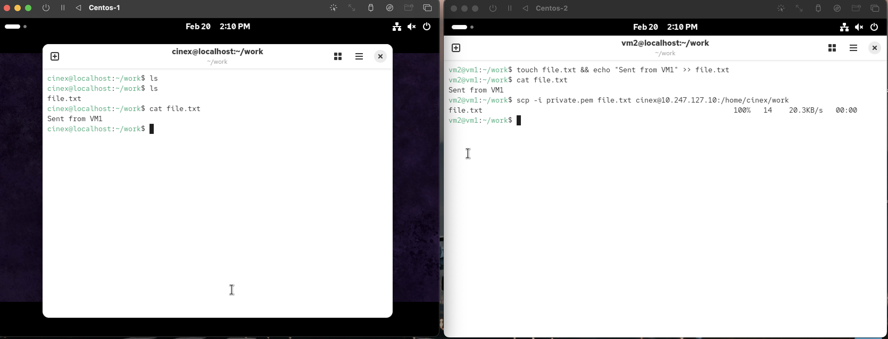
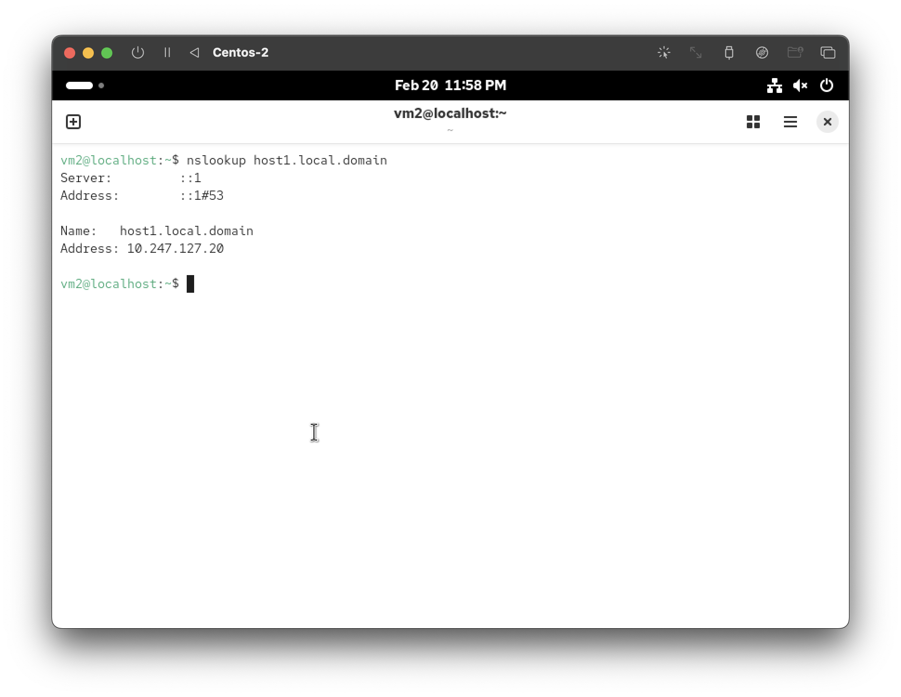
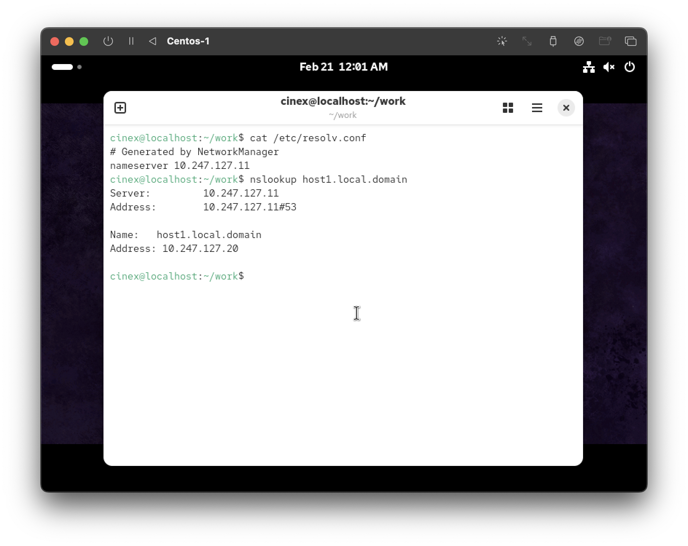

# Hands on networking in linux

1. **Create two centos VM with a bridge network - an IP adress that you define (not a container) - machine 1 & machine 2**



2. **Generate a private key on machine 2 using openssl - and the corresponding public key.**



3. **Deploy your public key on machine 1 and make sure the ssh server is up and that the local fireweall allows it.**



4. **Use ssh to connect from machine 2 to machine 1 + scp to send a locally created file to machine 1.**



> Trying to send something using `scp` command



5. **Install a bind service and create a local domain on machine 1 , using ssh from machine 1.**

There 3 crucial configuration files :
* `/etc/named.conf` : main configuration and zones.
* `/var/named/local.domain.zone` : forward configuration.
* `/var/named/local.domain.rev` : reverse configuration.

```yaml
# /etc/named.conf
options {
        listen-on port 53 { 127.0.0.1; 10.247.127.11; };
        directory       "/var/named";
        allow-query     { localhost; 10.247.127.0/24; };
        recursion yes;
        dnssec-validation auto;
};

# Forward DNS
zone "local.domain" IN {
        type master;
        file "local.domain.zone";
        allow-update { none; };
};

# Reverse DNS
zone "20.in-addr.arpa" IN {
        type master;
        file "local.domain.rev";
        allow-update { none; };
};

# /var/named/local.domain.zone
$TTL 86400
@       IN      SOA     ns1.local.domain. admin.local.domain. (
                        2024022001      ; Serial
                        3600            ; Refresh
                        1800            ; Retry
                        604800          ; Expire
                        86400 )         ; Minimum TTL

@       IN      NS      ns1.local.domain.
@       IN      A       10.247.127.20
ns1     IN      A       10.247.127.20
host1   IN      A       10.247.127.20
www     IN      CNAME   host1

# /var/named/local.domain.rev
$TTL 86400
@       IN      SOA     ns1.local.domain. admin.local.domain. (
                        2024022001      ; Serial
                        3600            ; Refresh
                        1800            ; Retry
                        604800          ; Expire
                        86400 )         ; Minimum TTL

@       IN      NS      ns1.local.domain.
20      IN      PTR     host1.local.domain.
```
Then we have to start bind service.

```bash
sudo systemctl start named
sudo systemctl status named # to ensure that service has started safely
```

After completing bind setup, we can test DNS functionality now :



Now, we have this machine 2 that will acts as DNS server. 
> Just to ensure that everything is working well, i have added the ip address of machine 2 in the `/etc/resolv.conf` in the machine 1, so it will use the bind service in the machine 2, as shown in the next screenshot. 



6. **Install an http server (httpd) and start it with a default index page that contains *:welcome to keiken*.**

