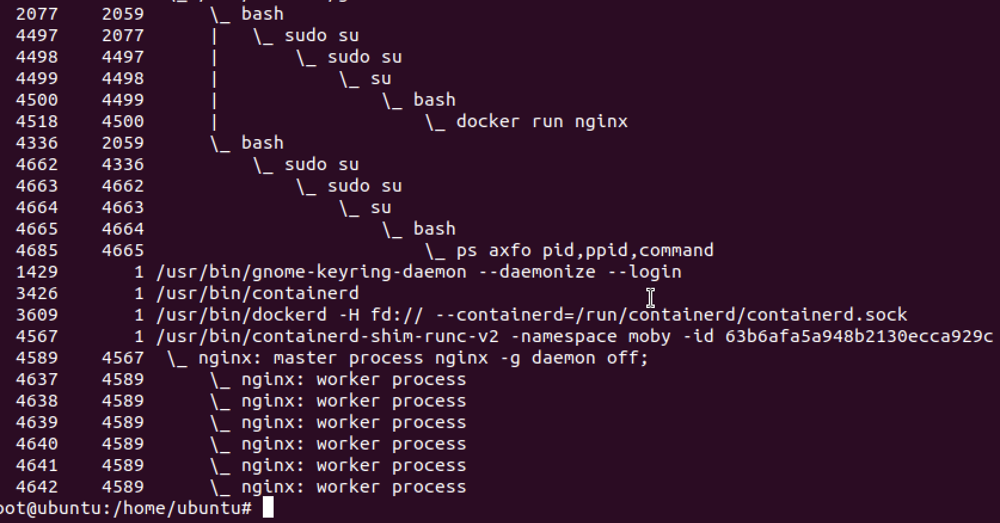
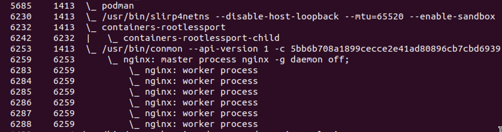

# Containers Runtime Structure

### Start docker container
`docker run nginx`
This will pull nginx image and run a container based on it.

### Exploring processes

We can clearly see that: 
* the `containerd` process with pid **3426**.
* the `dockerd` process with pid **3609**.
* the `containerd-shim` process with pid **4567**.

### Start podman container

We can clearly see that: 
* the `slirp4netns` process with pid **6230** : 
    - Creates a network namespaces without requiring root.
* the `containers-rootlessport` process with pid **6232**.
    - Handles port forwarding in a rootless context
* the `conmon` process with pid **6253**.
    - Used for container monitoring (equivalent to shim in `containerd`)

> Both `shim` and `conman` solve the same fundamental problem: how to maintain container processes and their I/O streams when the main container management tool is no longer directly supervising them.