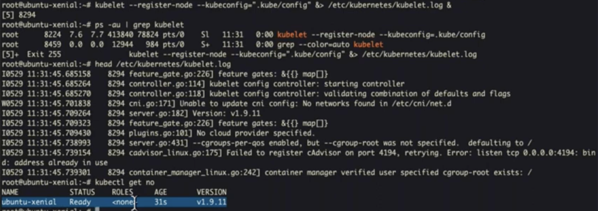
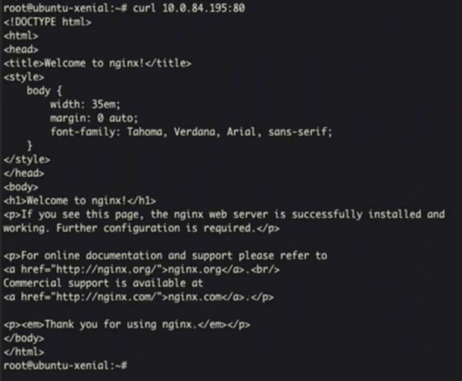

# Kubernetes Foundations

## kubelet

```yaml
# /etc/kubenetes/manifests/kubelet-test.yaml 
apiVersion: v1
kind: Pod
metadata:
  name: kubelet-test
spec:
  containers:
  - name: alpine
    image: alpine
    command: ["/bin/sh", "-c"]
    args: ["while true; do echo SupergIaNt; sleep 15; done"]
```

```bash
kubelet --pod-manifest-path /etc/kubenetes/manifests/ &> /etc/kubenetes/kubelet.log&
```

This commands will make kubelet check for pod configuration in this path `/etc/kubenetes/manifests/`, 

if we make `docker ps`, we can see that the container is running :


> Now, the kubelet works independently, without connecting to the Kubernetes API server


## etcd
A key-value distributed database that store the state of cluster.

```bash
etcd --listen-client-urls http://0.0.0.0:2379 --advertise-client-urls http://localhost:2379 &> /etc/kubernetes/etcd.log &
```

- This will tells etcd to listen for client connections on all network interfaces (0.0.0.0) on port 2379.

- `--listen-client-urls http://0.0.0.0:2379`: Tells etcd to listen for client connections on all network interfaces (0.0.0.0) on port 2379
- `--advertise-client-urls http://localhost:2379`: Tells etcd to advertise itself as available at localhost:2379 to other components


```bash
etcdctl cluster-health # To check cluster health
```

```bash
kube-apiserver --etcd-servers=http://localhost:2379 --service-cluster-ip-range=10.0.0.0/16 --bind-address=0.0.0.0 --insecure-bind-address=0.0.0.0 &> /etc/kubernetes/apiserver.log &
```

## api server

- `--etcd-servers=http://localhost:2379`: Configures the API server to use the local etcd instance running on port 2379

- `--service-cluster-ip-range=10.0.0.0/16`: Defines the IP range for Kubernetes services (10.0.0.0 to 10.0.255.255)

- `--bind-address=0.0.0.0`: Makes the API server listen on all network interfaces

- `--insecure-bind-address=0.0.0.0`: Enables insecure (non-HTTPS) access on all interfaces (not recommended for production)

Now, we can hit the api server in `localhost:8080` :


## Adding cluster


## Set context (and making it the main context)


## Register node 


You can clearly see that "standalone" is disappeared now, we cause we apiserver and etcd now, in contract of the first time when kubelet was running alone.

Now, we don't take instrcution from manifest anymore, instead we use apiserver (which is connected which kubectl commands)

## create pod from yaml

```bash
kubectl create -f kube-test.yaml
```

To verify we can get all pods with :

```bash
kubectl get pods
```

## Scheduler


At the top, the command `kubectl get po` shows a single pod named "kube-test" with READY status of 0/1, meaning it's in a "Pending" state. The pod exists but hasn't been scheduled to run on any node.

After running the command, another `kubectl get po` shows the "kube-test" pod is now in the "Running" state with READY status of 1/1, indicating the scheduler has successfully assigned the pod to a node.

## Deployment ressource
It's a higher-level resource that manages Pod replicas


## Controller manager


Controller manager is constantly monitors the state of various resources and ensures they match their desired specifications

At the top the commands `kubectl get deploy` and ``kubectl get pods` shows that there is no pods running even if the ressource is created 

Then we have started controller manager with this command :

```bash
kube-controller-manager --master=http://localhost:8080 &> /etc/kubernetes/controller-manager.log &
```

Controller manager make a control loops that watch the state of the cluster and make changes to move the current state toward the desired state.

In our case, the controller manager notice that there 3 desired pods but there are is now pods is actually running, so it start 3 pods.

## Service ressource

The service ressource aims to provide network connectivity to a set of Pods.


Now even if the service ressource is created, but we can access pod via `curl 10.0.84.195:80`

This issue will be solved by `kube-proxy`

## Kube-proxy

 kube-proxy is the component responsible for implementing the Kubernetes Service concept. It maintains network rules (like iptables rules) on each node that allow network communication to your Pods from inside or outside the cluster.

`kube-proxy --master=http://localhost:8080/ & /etc/kubernetes/proxy.log &`

