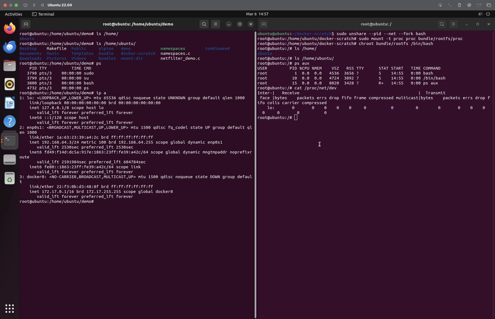

# Build Docker from the ground UP 1

First, using `unshare` command, i created pid and network namespaces then form a bash process and assign it to these namespaces, using the following command :

```bash
sudo unshare --pid --net --fork bash
```

Then inside the create bash process, i run this command `sudo mount -t proc proc bundle/rootfs/proc` to make process isolation.

Finally, i run this command `chroot bundle/rootfs /bin/bash`, to change the root directory view for the bash process.

> So when, running `ls /`, we will see the root directory which differs totally from the host root directory



So
- The network isolation is guaranteed with the `--net` flag un the `unshare` command.

- The process isolation is guaranteed with the `--pid --fork` flags and mounting the `/proc` folder.

- The root directory isolation is guaranteed with the `chroot` command.
